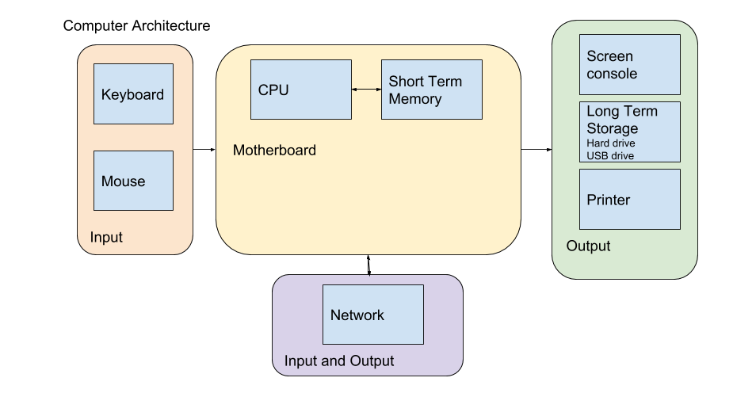

# Computers and You

Welcome to Python for Humanists. This first chapter will introduce you to basic architecture of computers and the basics of setting up your development environment. By the end of this chapter, you'll have exercises that will ask you to walk through getting your development environment set up and ready to go. 

## Computer Architecture


If you were to open up your computer, and I do recommend that you do so someday, you'll see a bunch of silicone chips and wires and tower looking things. Whenever we use our computer, regardless of how fancy and complex the output on our screen might be or the calculations that the machine can accomplish, all that is happening inside the computer is a bunch of electricity flowing across the metal in particular patterns that are meaningful and useful. The various components work together to create patterns that achieve whatever commands we or some developer have provided to the machine. 

To understand how Python is working and to understand Concepts in Computing, it is useful to know the anatomy of a computer. There are very many types of computers from the system in your car to your smartphone to your desktop to your digital watch. In a nutshell, computers are machines that take some sort of input, do some calculations on those input, and finally return some sort of output. A simple calculator, for instance, takes numbers and operators as inputs, processes those inputs by performing the input operators, and finally returns the result of that operation as an output. More complicated computers, like a smartphone, just take different types of inputs and perform more complicated processes.

Since all computers fundamentally do the same thing in varying degrees of complexities, they all have a basic set of components:

* Input and Output devices

* Processing Device
  
* Memory
  
* (Optional) Storage

Let's start with the Input and Output (I/O) devices. I/O devices are the features that allow the computer to interact with the world. Input devices include keyboards, mice, touch screens, and so on. Each input device takes a specific type of data. Output devices include printers, monitors, speakers, and so on. Each output device returns a specific type of data. Computers might have various I/O devices, sometimes built in, sometimes peripheral, but they all will have some sort of I/O otherwise they won't be able to take data and return results.

Memory is the next step. Memory is the space where data is stored when it is not immediately being processed. For instance, when you work in a Word document, your document is read from the long term storage to the memory. As you make changes, those changes are written to the memory, and when you "Save" the version of the document is written back to the long term storage medium. Memory is volatile, which means that when the computer shuts down or loses power, the memory is erased. The solution to this is long term storage, which will be covered below. If you've ever had the experience of working on a file and losing unsaved changes, it happened because those changes had not yet been written to long term storage.

Processing devices are the processor. Processors come in various flavors and functionality, but they are responsible for managing all of the components of the computer (the memory and the I/O devices), and for running calculations. Every operation in a computer is the result of calculations done in binary. The processor is doing that constantly, often several calculations at once if you have a processor capable of multi-threading. 

(Optional) Most computers also have some form of long term storage. This might be a hard disk drive, a solid state drive, or a memory card. These are physical media of various sorts that can have data written to them in a permanent or semi-permanent state. In the case of hard disk drives, data is stored as charges written to magnetic platters.

On larger computers like laptops and desktops, these components are usually connected through a motherboard that helps orchestrate the processes.

When we begin programming, it is useful to consider what part of the physical machine is performing a particular thing because it perhaps will help you visualize and make sense of what's going on. This is especially true when we get to variables and files. Interacting with variables means we are interacting with memory and interacting with files we are interacting usually with long term storage. 

## Beyond the Graphical User Interface

Most of the time when you interact with a computer, you probably are doing so through what is called a Graphical User Interface (GUI). When you open your web browser, for instance, you have a window with URL bar and menus and a main pane where the website code is rendered for your enjoyment. Likewise, when you search for files, you are probably using File Explorer or Finder, both of which are GUIs for interacting with the file system. GUIs allow you to use your mouse and keyboard to interact with the computer through visual icons and fields. I cannot overstate the importance of GUIs to the proliferation of computers. Without a GUI, you would either have to use a command line interface or punch cards to use a computer. GUI's allow non-experts to gain access without facing the steep learning curve of learning commands or code or punch card patterns. Instead, you can issue commands to the computer through an intuitive interface of icons, labelled fields, and so on. 

That being said, GUIs limit the efficiency at which you can work and frequently limit your ability to issue commands to the computer. This means that if you want to move from being a user towards being a maker or developer (one who uses the computer as is, to one who might explore what the computer can be made to do) is to become familiar with what is called a Command Line Interface (CLI). There are numerous CLIs ranging from DOS Prompt, Windows Command LIne, Powershell, Bash, etc. Even Python has a CLI, which allows you to issue Python commands directly to the Python interpreter (this will make more sense next chapter). CLIs allow the user to issue text based commands to the system (whichever system reads and interprets the commands). So, just as I could use a GUI to view, create, open, move, and delete files and folders in the above example by clicking on buttons and icons in the GUI to issue commands to the Operating System, so too can I use the CLI to view, create, open, move, and delete files and folders by entering commands as text via the keyboard into the CLI.

The particular CLI we will be using in this class is [BASH](https://en.wikipedia.org/wiki/Bash_(Unix_shell)). We are learning Bash instead of Command Prompt or Powershell because it is a very powerful "shell" that is built into all unix operating systems (Mac and Linux); however, at the time of writing, Mac is beginning to use Zsh instead, but the commands are largely the same so no worries. It is the standard CLI that you will encounter on nearly all web servers and will give you the most bang for your buck. Plus, it can be installed on Windows, and many bash commands are the saem in Powershell. 

Learning a CLI involves learning a set of commands (or "magic words") that are available. You won't need to memorize them all, but by spending time using the CLI, you will gradually pick them up. Why would we take the time to learn a CLI when you're already proficient at using a GUI? Great question!

GUIs are limited to the set of actions that the GUI designer thinks that most users will need. The actions are usually triggered by a mouse click, but advanced users will likely learn Hotkeys or keyboard shortcuts to make their work faster. However, the program often has a number of other commands or actions that are difficult to access via the GUI. Using a CLI often gives you more power and control over what the program is doing. 

GUIs involve using a mouse or tabbing through buttons with the keyboard. This means that they are much slower to do complicated tasks. Once you become familiar with a CLI, you will be much faster at doing the same kinds of tasks, and many tasks are less complicated using a CLI than they are using a graphical interface.

Let's say you decide to set up an application on a web server. First, that server exists in some server farm somewhere and the company that provides it allows you to access it remotely over a secure connection. That web server probably will not have a Desktop environment (a GUI for an operating system). Instead, it will have a CLI environment, and you will access it through a secure shell (ssh). Let's ignore the fact that the server will require that you use the CLI and think about how we might connect to that server remotely. To connect to that server, you set up an ssh connection. There are GUI programs that allow you to do this, like Putty, for instance. To do this, you must first install the program, then set up a connection through the form that the GUI provides and finally click the connect button. In Bash, however, all you have to do is type ```ssh username@server.com``` with any additional settings that might be necessary (e.g. you might need to type ```ssh -p 5257 username@server.com``` if you want to specify a particular port to connect to) and then hit enter. Likewise, many coding related applications have poor GUIs. Python's package manager (pip) for example only works in CLI. 

**One word of caution:**  CLIs give you greater power and control over the machine, but that means you can mess things up pretty severely. I recommend knowing what a command will do before you execute it. This is particularly important if you are reading advice from StackOverflow or some other online forum that answers questions. Likewise, if you are not already practicing good backup habits, not would be an ideal time to start because it is possible to break things or lose data (e.g. ```rm -rf /home/``` would delete all files installed by users without asking if you're sure).

## Installing Bash

So if you're a Mac or Linux User, you can skip this section. You already have Bash or Zsh installed on your computer. In Mac, you'll need to locate the application called Terminal. In Linux, usually the hotkeys to open a terminal is CTRL+ALT+T. 

If you're a Windows 10 user, you have two options. You can set up Windows Subsystem Linux. Since developers frequently prefer developing in a Unix environment like Mac or Linux (for many reasons which I won't go into here), Windows has built a subsystem that allows you to use Linux within your Windows operating system. I use this personally when I'm using my Windows computer, but it is a little bit fiddly and permissions can be weird. The option I will walk you through here is using Git Bash. Git is a version control program that we'll talk about in a little bit, but they have created a version of Bash that works on Windows. It's lovely. 

1. head over to Git's [download page](https://git-scm.com/downloads) and select the appropriate version of Git Bash to download.

2. Run the installer that you just downloaded. I use the default settings, but if you want to customize the installation, feel free.

3. Open Git Bash and a terminal will open up. Hooray.
   
## A taste of Bash

If you want a great tutorial on how to use Bash and even write scripts in the Bash scripting language, check out [Bash Academy](https://guide.bash.academy/) for a really detailed tutorial of Bash. I strongly recommend this because knowing your way around a CLI will make the work of this program much easier. I will give you a quick overview here of Bash. I'd encourage you to follow along on your computer. 

When you open a Bash terminal, you will see a window with a black background and some text. Mine lookes like this:

```user1@DESKTOP-61VJ97U:~$ _``` 

This is the prompt, and you'll see a cursor blinking right after the dollar sign. You can type commands here. Throughout this program, I will share code snippets and when I do, I will simply start with either ```~$ ``` or ```(env) ~$``` So if you are following along and it looks slightly different, just know I'm cutting out the username and host for brevity sake.

The first thing to learn about the CLI is how to navigate. Wherever the prompt is "located" in your file tree is where you will execute your commands. For example, if I am in a directory called "projects" and my prompt is set in that directory, then when I create a file it will be created within that directory. The first command we need to learn is **pwd** which stands for "print working directory." The working directory is where my terminal is currently working. For example, when I open a terminal, it automatically opens to the home directory, represented by the tilda (~). So when I issue the command:

```
~$ pwd
/home/user1
```
This means that my current working directory is ```/home/user1``` and any command I issue, unless I specify otherwise, will be executed in that directory. 

Next, I will use the **ls** command to show you what directories reside within my home directory:

```
~$ ls
Books  Projects  dylanmedina  experiments
```

Within my home directory I have Books, Projects, dylanmedina, and experiments. These are all directories that I can navigate into. These first two commands are crucial because they give me the location and context in which my CLI is operating. Now, let's say we're starting a new project, like this lesson. I might make a new directory for that project. To do so, I need to create a new directory and give it a name. The command is **mkdir** for "make directory." You follow that by the name of the directory. One word on names: spaces don't work because each word of a command is separated by a space. So if I wanted to create a directory called Python for Humanists, and I issued the command ```~$ mkdir Python for Humanists``` it would create three directories. One workaround is surround the name with quotation marks, but it's easier to just use names that don't have spaces. So let's go:

```
~$ mkdir pythonHumanist
~$ ls
Books  Projects  dylanmedina  experiments  pythonHumanist
```

You'll see, I created a directory called pythonHumanist and then I listed out the contents of my home directory, and you can see that my command worked. Now let's say we want to create our first Python script inside of the pythonHumanist directory. First, we can move into that directory and then we can create the file. To change directories we type **cd** followed by the absolute or relative path of the directory we want to visit. 

```
~$ cd pythonHumanist
~/pythonHumanist$
```

You'll notice that the tilda is now followed by the directory name in my prompt showing me conveniently where I am (my working directory). Next, we create a file in that directory called hello.py and add some text to that file. We can do this in one step, but I'm doing two so you can see two different commands:

```
~/pythonHumanist$ touch hello.py
~/pythonHumanist$ ls
hello.py
~/pythonHumanist$ echo "print('Hello World')" >> hello.py
```

A few notes. First, we used the **touch** command to create a file. The general syntax is ```touch {filename}``` where {filename} is replaced by the name of the file you want to create. If you want to create multiple files, you can list them with a space separating each file name. Again, the same "no spaces" rule applies. Second, I listed out the contents of the directory to show that the file was created. If you opened the file at this point, it will be empty. Finally, I used the **echo** command followed by two ```>>``` greater than signs. The echo command prints some text. The greater than symbols writes the output of the echo command to the file. If I use 2 greater than signs, the output is appended to the end of the file. If I use one greater than sign, the file is overwritten with the new content. After this command, you'll see that the file hello.py contains the text ```print('Hello World')```, which is Python code. More on that later. You can send the output of commands to other commands in Bash, and that ends up being a powerful feature. 

Next, let's say I want to copy files. This is really easy in Bash. The command is **cp** for copy and the syntax is ```cp {source} {destination}```

```
~/pythonHumanist$ cp hello.py hello2.py
~/pythonHumanist$ ls
hello.py  hello2.py
```

If you want to copy directories, you do so with the ```-r``` flag. Many commands have flags. These flags change the behavior of the command. In this case, I mean "copy recursively" or go through the contained directories and files and copy those as well as the outer directory that I named. 

The final command I want to cover here is **rm** which deletes files. **BE CAREFUL WITH THIS COMMAND BECAUSE THERE WILL NOT BE A PROMPT ASKING IF YOU'RE SURE YOU WANT TO DELETE A FILE**

```
~/pythonHumanist$ rm hello.py
~/pythonHumanist$ cd ..
~$ rm -r pythonHumanist
```

First, I remove the file hello.py using the **rm** command. Then I change directories up one level (```..``` signifies up one level) so I change the working directory to home. Then I remove the pythonHumanist directory using the ```-r``` flag. Again, many commands in Bash have flags that you can add that change the behavior. ```-r``` means recursive and it is what we use to remove directories. It means go into the directory, recursively delete all the files and then remove the directory. So if I had wanted to, I could have skipped removing the hello.py file first and just removed the directory and the file would have been deleted, too. 

There are many other commands that you will want to use, but I just wanted to give you a brief overview. We will encounter others that you'll have to learn as you go. If you have the time and energy, I strongly suggest spending a few hours and going further into Bash, as some of the concepts will make learning Python a bit easier. 

## Setup our Environment

We've done a bit of set up already and introduced you to the CLI. Now we need to finish getting things set up so that we can dive into Python next chapter. There are a few things we'll need. First, we need to get a good text editor. Python, as all code, is a bunch of human readable text that some program on the computer can understand and translate into the appropriate machine language that the computer can understand. There are tons of text editors out there and technically we could use Notepad for our code, but we want to use something with a few more features. **KEY:** do not use a word processor like Word to write code. When you use a word processor it adds extra markup to your file to display the formatting of the text and this will make your code non-functional. We will be using Visual Studio Code, but Atom is another good free option. I like Visual Studio Code because it gives you a file explorer and a terminal all built into one. 

1. Head over to the Visual Studio Code [download page](https://code.visualstudio.com/)

2. Download the installer for your operating system and run the installer.

3. Check the installation by opening Git Bash (or Bash if you're in Mac) and typing ```code --version```

4. Set up User Settings in Visual Studio Code

VS Code allows you to customize settings for all projects (User Settings) or for a single project (Workspace settings). To modify default settings select Code | Preferences for the Mac or File | Preferences for Windows and then Settings. You will see 2 files side by side. On the left are the default settings and on the right are the User setting overrides.

To change a default setting find the setting on the left and then copy it to the right with your desired setting. For example, if you don't want to see the minimap on the right hand side of the application, you can make the following entry in the file on the right. Notice that options are key : value pairs and that they are commas separated.

```
{

"editor.minimap.enabled":false

}
```

Make "Git Bash" the default command line in VS Code terminal by adding the following to your User Settings:

```
"terminal.integrated.shell.windows": "C:\\Program Files\\Git\\bin\\bash.exe"
```

### Install Python

You'll also need to install Python. Python has a number of versions, and Python 3 is the one we will be using. If you are on Windows, you don't have Python. If you're on Mac or Linux, you have Python 2 so you need to add Python 3. 

#### Installing Python on Windows

1. Head to the Python [downloads page](https://www.python.org/downloads/) and select the Python 3 installer.

2. Run the installer, and allow it to add Python3 to the Path. This is important, so make sure you pay attention to the option for adding Python3 to your PATH. 

3. Once you've installed Python3, open Git Bash and type ```python --version``` and you should get a version number back. If not, or if you get an error, try to close Bash and open it again. If that doesn't work, try installing again. If it still doesn't work, probably Python was not added to the PATH. You can Google adding Python to the PATH in Windows.
   
#### Installing Python 3 on Mac

Macs come with Python2 installed, so you will need to install Python3. Note, **DO NOT UNINSTALL OR OTHERWISE REMOVE PYTHON 2**. It will break your operating system.

1. Head to the Python [downloads page](https://www.python.org/downloads/) and select the Python 3 installer.

2. Run the installer. (Don't worry about the PATH, as that's not an issue we deal with in UNIX in the same way.)

3. Once you've installed Python3, open Git Bash and type ```python3 --version``` and you should get a version number back. If not, or if you get an error, try to close Bash and open it again. If that doesn't work, try installing again. Also, if you type ```python --version``` it will say python 2.7 or something like that. By default on Mac and Linux, Python 2 is installed so the ```python``` command will use Python 2. We need to use ```python3``` instead until we setup virtual environments.
   
### Set up Github

Github is awesome! It is a place where you can share code and manage version control. Please do not get confused between Github and Git. Git is a CLI program that manages version control. Every time you "commit" changes with git, you create a new version. Behind the scenes, git manages a set of diff files that keep track of the changes that were made to the repository (or collection of code) since the last commit.

Github is an online storage service that integrates with git and allows you to push your code to this service and share it both with teams and publicly.

I'm not going to go over the Git commands here, but here is a [good tutorial](https://learngitbranching.js.org/).
